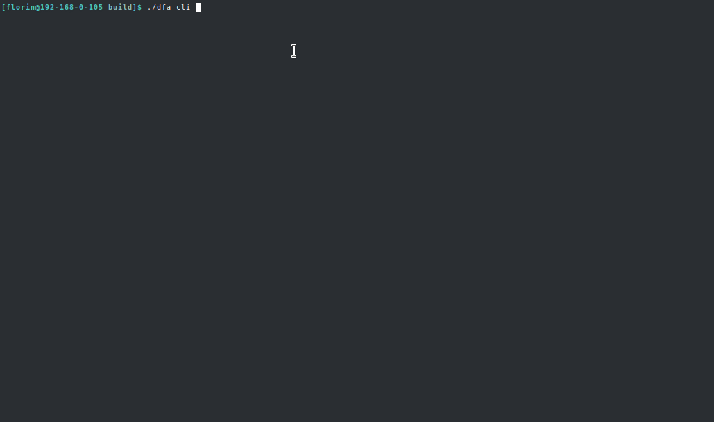

# dfa-cli

Deterministic Finite Acceptor CLI Simulator

## Requires:
- CMake 3.5

## Compile:

1. git clone https://github.com/florinDNL/dfa-cli.git
2. mkdir dfa-cli/build && cd dfa-cli/build
4. cmake ..
5. make

## Demo:

  
